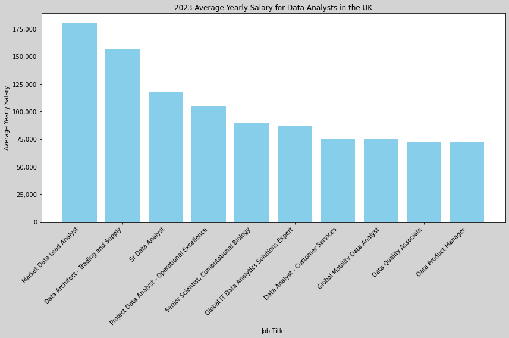
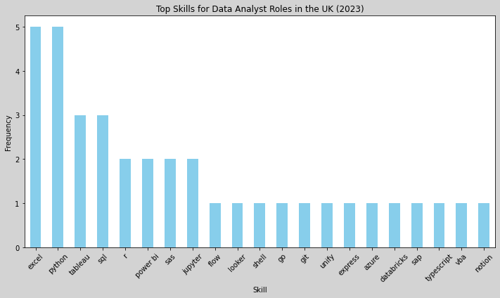

# Project: Data Analytics Job Market in the United Kingdom

# Introduction

In today's data-driven world, the demand for skilled professionals in data science and analytics has never been greater. As organizations across industries recognize the value of harnessing data to drive informed decision-making and gain competitive advantage, the role of the data analyst has become increasingly vital. For aspiring data analysts, understanding the job market landscape, acquiring the necessary skills, and staying abreast of industry trends are paramount to success in this dynamic field

In this project, we will delve into the intricacies of data-analytics job market. I will be particularly focusing in the United Kingdom Job Market in 2023. The overall aim of this project is to offer direction to the aspiring data analysts for prioritizing relevent skills and job-search-strategies so they can better position themselves for a rewarding career in the field of data-analytics. 

For SQL queries, please visit my repo here: [project_sql](/project_sql/)

# Background

The project was developed as a part of my learning experience to hone my SQL skills, as I was going through Luke Barousse & Kelly Adam's Data Analytics Course. The database used for this project was pulled from the following [SQL COURSE](https://www.lukebarousse.com/sql).

I aim to answer below questions through my SQL queries:
1. What are the top-paying data analyst jobs in the United Kingdom in 2023?
2. What skills are required for these top-paying jobs?
3. What skills are most in-demand for data analysts in the United Kingdom?
4. Which skills are associated with higher salaries in the United Kingdom?
5. What are the most optimal skills to learn to stand out in the overall Job Market for Data Analysts in general?

# Tools I Used

For this project, I used the below tools:

**SQL**: The core database programming language of my analysis, that allowed me to query the database and generate critical insights.

**PostgreSQL**: The chosen database management system, ideal for handling the job posting data.

**Visual Studio Code**: My go-to for database management and executing SQL queries.

**Git & GitHub**: Essential for version control and sharing my SQL scripts and analysis, ensuring collaboration and project tracking.

# The Analysis

Each query for this project is aimed at investigating specific aspects of the data analyst job market in the United Kingdom in 2023. Below is how I approached each questions:

### 1. Top Paying Data Analyst Jobs in the UK
To identify the highest-paying data analyst jobs in the UK, I filtered data analyst positions by average yearly salary, location and shedule type (full-time or not). This query highlights the high paying opportunities in the field.

```sql
SELECT
    job_id,
    job_title,
    job_location,
    job_schedule_type,
    salary_year_avg,
    job_posted_date,
    name AS company_name
FROM 
    job_postings_fact
LEFT JOIN company_dim ON job_postings_fact.company_id = company_dim.company_id
WHERE
    job_title_short = 'Data Analyst' AND
    job_location LIKE  '%United King%' AND
    --job_schedule_type = 'Full-time' AND (This query can be used to filter out only Full-time jobs)
    salary_year_avg IS NOT NULL
ORDER BY
    salary_year_avg DESC
LIMIT 10
```
Here's the breakdown of the top data analyst jobs in the UK in 2023:

Wide Salary Range: Top 10 paying data analyst roles span from $180,000 to $75,000, indicating significant salary potential in the field.

Diverse Employers: Companies like Deutsche Bank, Shell, Hasbro, and Chanel are among those offering high salaries, showing a broad interest across different industries.

Job Title Variety: There's a high diversity in job titles, from Market Data Lead Analyst, Data Architect, Sr Data Scientist, Fraud Data Analyst to Global IT Data Analytics Solutions Expert, reflecting varied roles and specializations within data analytics.



Bar graph visualising the salary for the top 10 salaries for data analysts in the UK using ChatGPT. 

### 2. Skills for Top Paying Jobs in the UK
To understand what skills are required for the top-paying jobs, I joined the job postings with the skills data, providing insights into what employers value for high-compensation roles.

```sql
WITH top_paying_jobs AS (
    SELECT
        job_id,
        job_title,
        salary_year_avg,
        name AS company_name
    FROM 
        job_postings_fact
    LEFT JOIN company_dim ON job_postings_fact.company_id = company_dim.company_id
    WHERE
        job_title_short = 'Data Analyst' AND
        job_location = 'United Kingdom' AND
        salary_year_avg IS NOT NULL
    ORDER BY
        salary_year_avg DESC
    LIMIT 10
)

SELECT 
    top_paying_jobs.*,
    skills
FROM top_paying_jobs
INNER JOIN skills_job_dim ON top_paying_jobs.job_id = skills_job_dim.job_id
INNER JOIN skills_dim ON skills_job_dim.skill_id = skills_dim.skill_id
ORDER BY 
    salary_year_avg DESC
```

Here's the breakdown of the most demanded skills for the top 10 highest paying data analyst jobs in 2023:

**EXCEL** and **Python** are leading with a count of 5. Despite the emerging new data technologies and tools, excel continues to be relevent in the data analytics job market, at least in the United Kingdom. 

**Tableau** and **SQL** are in the second place with a count of 3 each.

Other skills that are sought after are: R, Power BI, SAS, Jupyter, Flow, Looker, git, Snowflake, Databricks, etc. 




### 3. In-Demand Skills for Data Analysts in the UK
This query helped identify the skills most frequently requested in job postings, directing focus to areas with high demand.

```sql
SELECT 
    skills,
    COUNT(skills_job_dim.job_id) AS demand_count
FROM job_postings_fact
INNER JOIN skills_job_dim ON job_postings_fact.job_id = skills_job_dim.job_id
INNER JOIN skills_dim ON skills_job_dim.skill_id = skills_dim.skill_id
WHERE
    job_title_short = 'Data Analyst' AND
    job_location = 'United Kingdom'
GROUP BY
    skills
ORDER BY
    demand_count DESC
LIMIT 5
```
Here's the breakdown of the most demanded skills for data analysts in 2023 in the UK.

**SQL** and **Excel** remain fundamental, emphasizing the need for strong foundational skills in data processing and spreadsheet manipulation.
Programming and Visualization Tools like **Python**, **Tableau**, and **Power BI** are essential, pointing towards the increasing importance of technical skills in data storytelling and decision support.

| Skills   | Demand Count |
|----------|--------------|
| SQL      | 867          |
| Excel    | 776          |
| Power BI | 557          |
| Python   | 455          |
| Tableau  | 361          |

Table of the demand for the top 5 skills in data analyst job postings

### 4. Skills Based on Salary in the UK
Exploring the average salaries associated with different skills revealed which skills are the highest paying in the UK for Data Analyst roles in 2023.

```sql
SELECT 
    skills,
    ROUND(AVG(salary_year_avg),0) AS avg_salary -- Rounding off values to a more readable format
FROM job_postings_fact
INNER JOIN skills_job_dim ON job_postings_fact.job_id = skills_job_dim.job_id
INNER JOIN skills_dim ON skills_job_dim.skill_id = skills_dim.skill_id
WHERE
    job_title_short = 'Data Analyst' AND
    job_location = 'United Kingdom' AND
    salary_year_avg IS NOT NULL
GROUP BY
    skills
ORDER BY
    avg_salary DESC
LIMIT 10
```
Here is the insights I discovered:

Top Skills by Average Salary in the UK in 2023:

|   skills   | avg_salary |
|------------|------------|
|   flow     |   156,500  |
|   shell    |   156,500  |
|   looker   |   118,140  |
|    sas     |   109,000  |
|  express   |   104,757  |
|  jupyter   |   103,620  |
|    git     |    89,100  |
|   unify    |    89,100  |
|   azure    |    86,400  |
|    sap     |    86,400  |

### 5. Most Optimal Skills to Learn in the Job Market in general

This query aimed to identify the most desired skills that corelates with high paying jobs so job hunters can focus strategically to develop their skills.

```sql
WITH skills_demand AS (
    SELECT 
        skills_dim.skill_id,
        skills_dim.skills,
        COUNT(skills_job_dim.job_id) AS demand_count
    FROM job_postings_fact
    INNER JOIN skills_job_dim ON job_postings_fact.job_id = skills_job_dim.job_id
    INNER JOIN skills_dim ON skills_job_dim.skill_id = skills_dim.skill_id
    WHERE
        job_title_short = 'Data Analyst' AND
        job_work_from_home = True AND
        --job_location = 'United Kingdom' : Use this line for UK related jobs
        salary_year_avg IS NOT NULL
       
    GROUP BY
        skills_dim.skill_id
) , average_salary AS (
    SELECT 
        skills_dim.skill_id,
        skills_dim.skills,
        ROUND(AVG(salary_year_avg),0) AS avg_salary
    FROM job_postings_fact
    INNER JOIN skills_job_dim ON job_postings_fact.job_id = skills_job_dim.job_id
    INNER JOIN skills_dim ON skills_job_dim.skill_id = skills_dim.skill_id
    WHERE
        job_title_short = 'Data Analyst' AND
        job_work_from_home = True AND
        --job_location = 'United Kingdom' AND
        salary_year_avg IS NOT NULL
    GROUP BY
        skills_dim.skill_id
)

SELECT
    skills_demand.skill_id,
    skills_demand.skills,
    demand_count,
    avg_salary
FROM
    skills_demand
INNER JOIN average_salary ON skills_demand.skill_id = average_salary.skill_id
WHERE
    demand_count > 10
ORDER BY
    avg_salary DESC,
    demand_count DESC 
--LIMIT 25 : to see top 25 results
LIMIT 10;
```
| Skill ID | Skills     | Demand Count | Avg Salary |
|----------|------------|--------------|------------|
| 8        | go         | 27           | 115320     |
| 234      | confluence | 11           | 114210     |
| 97       | hadoop     | 22           | 113193     |
| 80       | snowflake  | 37           | 112948     |
| 74       | azure      | 34           | 111225     |
| 77       | bigquery   | 13           | 109654     |
| 76       | aws        | 32           | 108317     |
| 4        | java       | 17           | 106906     |
| 194      | ssis       | 12           | 106683     |
| 233      | jira       | 20           | 104918     |

*Table of the most optimal skills for data analyst in the UK sorted by salary*

Below is the breakdown of the most optimal skills for Data Analyst in the UK in 2023. 

**1. High-Demand Programming Languages:** Python and R stand out as one of top paying skills to learn with higher demand count and higher salary. 

**2. Cloud Tools and Technologies:** Cloud technologies related skills such as Snowflake, Azure, AWS, and BigQuery are also quite prominent with significant demand and relatively high average salaries. This indicates growing demand of big data and cloud technologies

**3.Business Intelligence and Visualization Tools:** Tableau, Looke and qlik also made it to the list highlighting significance of mastering the skills of data visualizations and reporting for data analysts.

**4. Database Technologies:** The demand for skills in database technologies such as SQL and sqlserver, NoSQL etc highlight the importance of database management technologies.

# What I learned

Delving into SQL for this data project felt akin to embarking on a new journey. Below is a reflection on my experience and the skills I refined:

**1. Exploring Advanced SQL Techniques:** I delved into some of SQL's more sophisticated features, such as Common Table Expressions (CTEs), window functions, and complex JOINs. Utilizing these tools enabled me to conduct intricate analyses, such as identifying top-paying roles and evaluating the value of specific skills.

**2. Mastering Grouping and Aggregation:** Proficiency in aggregating and grouping data proved essential for uncovering patterns, such as identifying sought-after skills or lucrative job opportunities. Leveraging SQL's aggregation functions allowed me to distill large datasets into actionable insights.

**3. Enhancing Filtering Abilities:** The WHERE clause became a vital tool for filtering data to extract specific insights, whether it was isolating job listings by location or focusing on particular job titles. This enabled me to shift through data noise and concentrate on pertinent information.

**4. Deriving Insights from Data:** Transforming query results into meaningful insights resembled solving a series of puzzles. This project significantly enhanced my capacity to interpret data beyond numerical values, discerning the underlying narratives they convey.


# Insights

**1. Top-Paying Data Analyst Job in the United Kingdom:** The highest-paying data analyst positions in the United Kingdom present a varied salary landscape, with the highest at $180,000.!

**2. Skills for Top-Paying Jobs in the United Kingdom:** High-paying data analyst roles in the United Kingdom necessitate advanced proficiency in excel, python, tableau and sql indicating their significance in securing top-tier salaries.

**3. Most In-Demand Skills in the United Kingdom:** SQL remains the most sought-after skill in the United Kingdom's data analyst job market, underscoring its importance for job seekers.

**4. Skills with Higher Salaries in the United Kingdom:** Specialized skills like flow, shell, looker, saas, express, and git are linked to the highest average salaries, highlighting the premium placed on specialized expertise.

**5. Optimal Skills for Job Market Value:** Python emerges as the leader in demand and salary offers, positioning it as one of the most advantageous skills for data analysts to acquire in order to maximize their market value.

# Conclusions
This project enabled me to strengthen my SQL expertise and gain valuable insights into the data analyst job market in the UK. The results obtained from the analysis offer direction for prioritizing skill development and job search strategies. Aspiring data analysts can enhance their prospects in a fiercely competitive job market by emphasizing skills that are both in high demand and offer lucrative salaries. This analysis underscores the significance of ongoing learning and adaptability to stay informed of emerging trends in the dynamic field of data analytics.